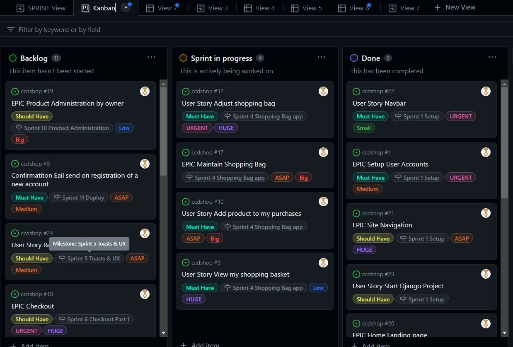
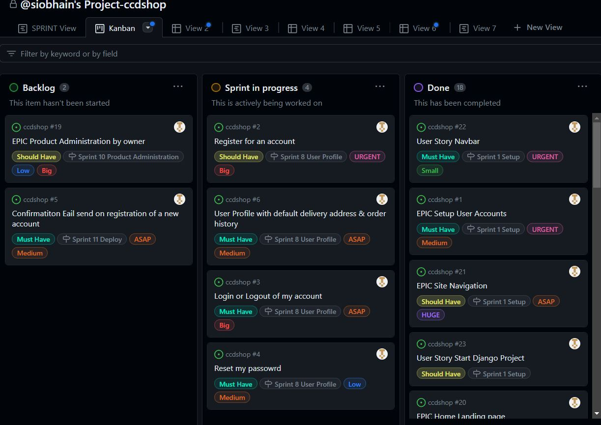
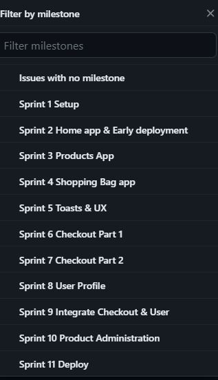
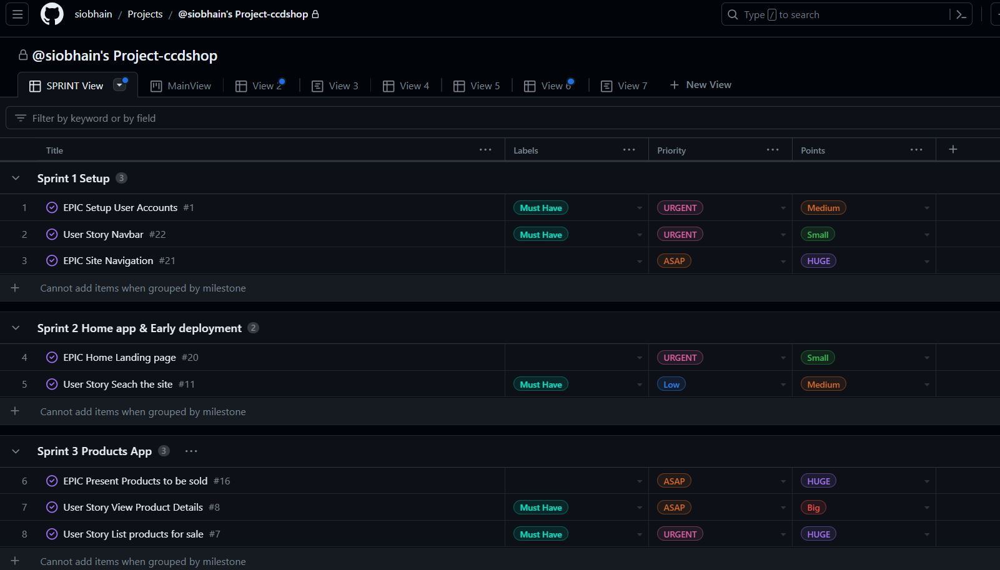

## GitHub Project

The GitHub Project is called  `@siobhain's Project-ccdshop` & go [here](https://github.com/users/siobhain/projects/11) to view it.

I created Issue templates for Epics and User Stories & these are saved in the initial commits before I started with Django.  I added custom field for Story Points in the form of color coded size options : X-Large, Large, Medium, Small, Tiny.  As this was a one person project team velocity did not come into play.

Note that as user stories are completed & thereby moved to the DONE column it is not now possible to see state of the Kanban during the project so here are some snapshot of the board at Sprint 2, 4 & 8 respectively.

  
  
  

### Sprints
Sprints are managed via milestones as follows

Here is a 

I created a Project Sprint view [here](https://github.com/users/siobhain/projects/11/views/8)
