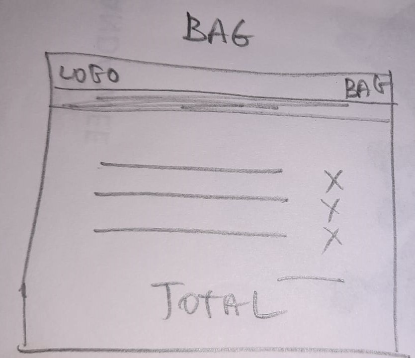

#  Memory Lane Jewellery

- You can view the live site here (https://memorylane-jewellery-63c74e421293.herokuapp.com/bag/)

Unfortunatley the README is incomplete and sorry to the reader a bit messy as late in the day 500 server error etc kept me from spending time in this, apologies

### About 

Memory Lane Jewellery is a fictional online jewellery store selling handmade jewellery.  All pieces are designed and carefully crafted by master goldsmith Siobhan O'Brien. She has created a range of jewellery that can be of sentimental & nostalgic value to whomever wears it.  Each is designed to help create precious memories,  mark milestones & is made from highest quality precious metals for you to enjoy over a lifetime & cherish as family heirlooms.

Message from Siobhan
I can offer custom engravings on my rings & pendants.  Please contact xxx-xxx-xxxx to arrange.

### B2C

This is a business to customer application.  There are several products and a single payment per order. Customers can purchase anonymously or can register for an account in which case they can safe their delivery informaiton &/or subscribe to a quarterly newsletter.  Payment is via Stripe & banking details are not held or saved.

### Agile

[AGILE.md](AGILE.md) file.

### UX

The UX of Boutique is followed almost exactly, I was hoping to put more of my own stamp on it after getting MVP working etc but alas ran out of time.

#### Wireframes

#### Features

Site has all the features of Boutique Ado with following additions/amendments

- Navigation Dropdowns : Browse, For Her, Design, Specials
- custom helper functions in bag_tools & checkout_tools
- no decimal places in Product model
- Product model has 2 boolean fields - sizeable & engrave, Sizeable is used extensively but never got chance to use engrave.
- Product model also have Collection field
- Order model has boolean subscribe_newsletter
- Items in bag/order/messages  etc are presented  as follows
    

#### Checkout

##### Stripe currency & Pricing

The currency is set to Euro in settings.py as all goods are for sale from Ireland.  Stripe requires all Euro amounts to be provided in cents, cents being the smallest Euro unit.  In keeping with the business strategy of whole number pricing,  it was necessary to round up `grand_total` & `stripe_total` using `math.ceil()` when including delivery costs.

#### Product Pricing
It is a strategic business decision to opt for whole number pricing in order to maintain the feeling of exclusivity and quality in the goods.  The discerening customer would not fall for the charm pricing of say €49.99.

#### Stripe Secrets

Use `<input type="hidden"..>` to pass the `client_secret` to stripe server, With the hidden attribute set the user cannot view or interact with the value being passed

##### Redundancy for payment system on chekcout app

There is redundancy build into the Checkout app during Stripe payment processing in cases where the user might close the browser or lose power/connectivity or do something on the client/frontend side that breaks connection with the server during payment processing (the js .done .then on 'stripe.confirmCardPayment') causing the order not to be submitted to the database even though the payment has been made. This is for edge cases only and is achieved by listening for particular stripe webhooks (wh's) which operate like signals in the background and are unaffected by whats going on front end. It is the same implementation as **BoutiqueAdo**. The Stripe account is configured to send wh's to an endpoint such as `https://memorylane-jewellery-63c74e421293.herokuapp.com/checkout/wh/`. A `payment_intent.succeeded` webhook is send by Stripe to signify that the payment has been completed.  Therefore if/when that particular wh is received we know for definite that payment has been made & in normal cases the order will already have been created by `views.checkout` (abeit a slight delay in writing to db using false commit on the save `order_form.save(commit=False)`).  However in an edge case where something happens frontend so that order never gets created in the db, the `payment_intent.succeeded` wh handler will create the order if it finds that it does not exist in the db.  There is a boolean field on the Order model called 'CreatedByWebhook` to track such cases.  The site administrator can check for this phenomena using filter on the django admin interface.

## Testing

[TESTME.md](TESTME.md) file.

 
### Deploy

- Create a Database eg Elephant SQL
- Create a new Heroku app
- Connect the db to local development server
- Confirm DB is connected
- first deploy with debug off & disable collect static
- upload media to s3 & grant public access
- create new stripe webhook endpoint (url for heroku app)
- reveal and add webhook signing secret to heroku config vars matching var names in settings.py

 Deployment 
- The site was deployed to GitHub pages. The steps to deploy are as follows:
  - In the GitHub repository, navigate to the Settings tab.
  - Open the pages tab on the left hand side of the page.
  - From the source section drop-down menu, select the Master Branch.
  - Once the master branch has been selected, the page will be automatically refreshed with a detailed ribbon display to indicate the successful deployment.

- You can view the live site here (https://memorylane-jewellery-63c74e421293.herokuapp.com/bag/)

### Credits

Images taken from https://www.cooksongold.com/

#### Bugs

#### Favicon

The favicon has not rendered on the deployed version & still trying to correct this at writing.   It did appear on the development sever 

#### 404

Followed LMS but could not get it working
