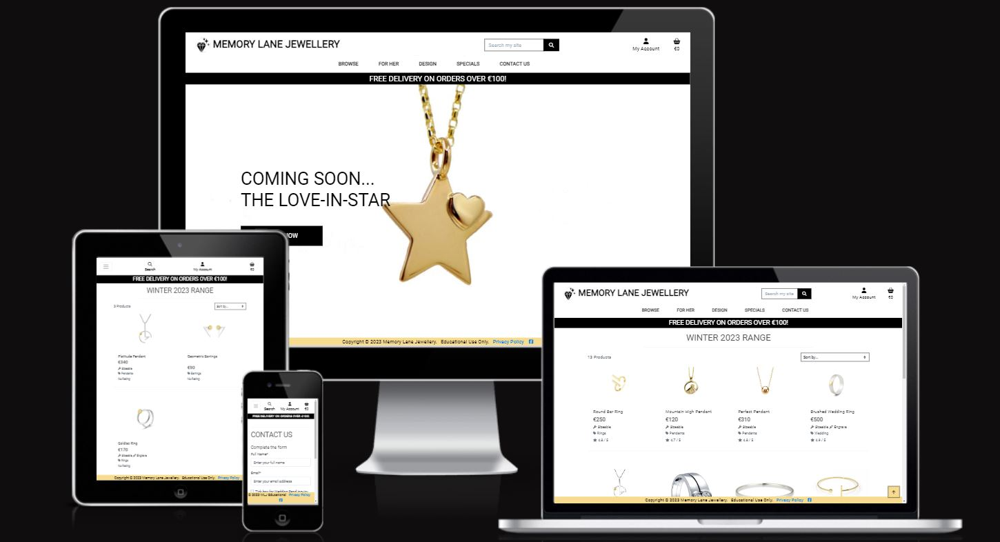
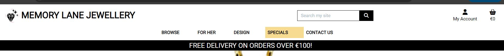
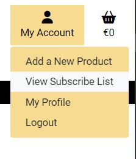
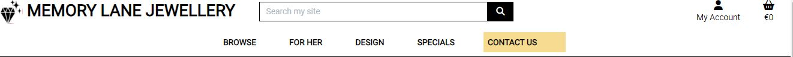
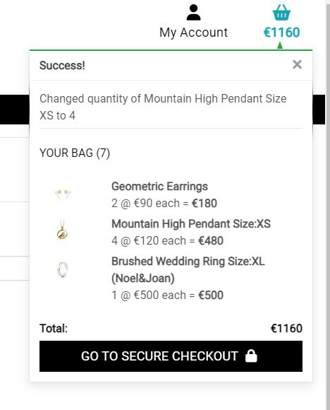

#  Memory Lane Jewellery

- You can view the live site here (https://memorylane-jewellery-63c74e421293.herokuapp.com/bag/)

### About 

Memory Lane Jewellery is a fictional online jewellery store selling handmade jewellery.  All pieces are designed and carefully crafted by master goldsmith Julia Diamond. She has created a range of jewellery that can be of sentimental & nostalgic value to whomever wears it.  Each is designed to help create precious memories,  mark milestones & is made from highest quality precious metals to be enjoyed over a lifetime & cherish into the future 

#### Owners Stipulation about Product Pricing & Quantity limits.
The owner Julia has specified that it is a strategic business decision to opt for whole number pricing in order to maintain the feeling of exclusivity and quality in the goods.  It is thought the discerening customer would not fall for the charm pricing of say €49.99.as a family heirloom. Therefore there are to be no decimal points rendered on the website.

In addition Julia the owner has requested that the quantity ordered be limited to a maximium of 5 as these pieces are all handmade and not mass produced.  At times it may be necessary for her to make to order which may result in delays, in those cases she will contact the customer directly herself.

Owner does not envisage regular newsletters but perhpas quarterly end of line/offers made exclusively to cusomters - as stock is limited - that have registered for account. Therefore owner will not need mailchimp, A simple `subscribe_newsletter` boolean field in the UserProfile model will suffice, When true user will get newsletter otherwise not & Users are presented with choice during checkout process if they would like to signup for newsletter or not.

### B2C

This is a business to customer application.  There are several products and a single payment per order. Customers can purchase anonymously or can register for an account in which case they can safe their delivery information &/or subscribe to a quarterly newsletter.  Payment is via Stripe & banking details are not held or saved.

### Agile

Link to [AGILE.md](AGILE.md) file.

### UX

The UX of Boutique is followed almost exactly, I was hoping to put more of my own stamp on it after getting MVP working etc but time not on my side.

Link to [WIREFRAMES.md](docs/WF.md) file.

## Features

### Common Header & Footer

Header 
Footer 

#### Header Menu & Icons

##### Memory Lane Jewellery 
If any part of Memory Lane Jewellery or the favicon is clicked it will return user to the home page.

##### Search
Search is implemeted same as Boutique Ado.

##### My Account
|No User logged in|Admin logged in|User logged in|
| :---: |:---:|:---:|
||||
|Option to `Register` as new user or `Login`|Extra Option to `Add product`|Option to view Profile incl order history|

##### Basket 
The Basket icon when clicked goes to Shopping Bag page

##### Banner
Currently the banner has a free delivery message, this may change depending on time of year.

##### Dropdown Menus
| Browse :`By Price` selected | For Her : `Bracelets` selected|Design  : `Mix` selected|Specials : `Latest Designs` selected|
| :---: |:---:|:---:|:---:|
|||||

Update : 
A `Contact Us` app` was subsequently added so apologies as some screenshots may be out of date & missing the menu item.

##### Footer

Footer has link to a privacy policy & a mockup facebook business page.

### Home Page (All pages include header & footer described above)

The home page has a large `SHOP NOW` button to intice the user to shop, There is hint of the next collection which is called Love-in-Star & a pic of the pendant from this collection.

### SHOP NOW (Products App)

The `SHOP NOW` button leads the the all products page, currently 12 in the database.  There is a count on top LHS & a Sort dropdown on RHS, The sort can be by Price, Rating, Name or Category & in either direction.  On large screen porducts are displayed 4 across reducing to 3 on tablet sized screen and eventually stacked on top of each other on small mobile screens.

| Laptop | Tablet | Mobile |
| :---: |:---:|:---:|
||||

Each product has an image, a name and the following details : Category, Price, Rating (see below).  Once the user clicks on an image the product detail page will be loaded.

### Product Detail page

|Product sizeable False|Product sizeable True, engrave False| Product sizeable True, engrave True|
|:---: |:---:|:---:|
||||

Once in the product detail page it is possible to add the product to the shopping bag with `Add to Bag` button.  
Once item is added to the bag the user will get a toast message as follows

|Product sizeable False|Product sizeable True, engrave False| Product sizeable True, Engrave True|
|:---: |:---:|:---:|
||||

### Bag app
This page gives the details of items currently in the bag.

 There are `update` and `remove` links under the Quantity selector for each line item in the bag, this allows user to adjust the quantity (via `update`) or remove the item altogether, Doing either will result in the bag being updated and toast message to the user, In these screenshots I show the `update` 

|Adjust Product sizeable False|Adjust Product sizeable True, engrave False| Adjust Product sizeable True, Engrave True|
|:---: |:---:|:---:|
||||

So Removing the Pendant from the shopping bag and adjusting quantities this is contents of shopping bag we will checkout with by clicking on `SECURE CHECKOUT` button on right hand side at end of the page.

### Checkout app

User is presented with form to complete delivery details & a summary of the order, If user is logged in and has already chosen to save their delivery details the form will be prefilled.

#### Registered Users : 

Back to our guest order we can see that the order summary contains a count, and line item details including quantity, price & if relevant size and engraving text, subtotal and total.

Fill out the delivery details to complete the order

User will see  this overlay while stripe does its work

& then be presented with toast message & confirmation of order.

User also receives an email unfortunatley don't have screenshot for this order but here is one from an order earlier this month

The order has been added to the database (as seen by the admin user) & as CreatedByWebhook in Order is false I know that the order was created by `checkout.views.checkout` & not checkout.webhook_handler`.  This  aisll immaterial to the user but may be of benefit to the owner/administrator. Majority of orders should be created by checkout and not by webhook handler, If there is an increase in webhook order than it warrents investigation.

Engrave Text is saved in the OrderLineItem.

#### Stripe

The currency is set to Euro in settings.py as all goods are for sale from Ireland.  Stripe requires all Euro amounts to be provided in cents, cents being the smallest Euro unit.  In keeping with the business strategy of whole number pricing,  it was necessary to round up `grand_total` & `stripe_total` using `math.ceil()` when including delivery costs.

##### Stripe Secrets

Use `<input type="hidden"..>` to pass the `client_secret` to stripe server, With the hidden attribute set the user cannot view or interact with the value being passed

##### CreatedByWebhook : Redundancy for payment system on chekcout app

There is redundancy build into the Checkout app during Stripe payment processing in cases where the user might close the browser or lose power/connectivity or do something on the client/frontend side that breaks connection with the server during payment processing (the js .done .then on 'stripe.confirmCardPayment') causing the order not to be submitted to the database even though the payment has been made. This is for edge cases only and is achieved by listening for particular stripe webhooks (wh's) which operate like signals in the background and are unaffected by whats going on front end. It is the same implementation as **BoutiqueAdo**. The Stripe account is configured to send wh's to an endpoint such as `https://memorylane-jewellery-63c74e421293.herokuapp.com/checkout/wh/`. A `payment_intent.succeeded` webhook is send by Stripe to signify that the payment has been completed.  Therefore if/when that particular wh is received we know for definite that payment has been made & in normal cases the order will already have been created by `views.checkout` (abeit a slight delay in writing to db using false commit on the save `order_form.save(commit=False)`).  However in an edge case where something happens frontend so that order never gets created in the db, the `payment_intent.succeeded` wh handler will create the order if it finds that it does not exist in the db.  There is a boolean field on the Order model called `CreatedByWebhook` to track such cases.  The site administrator can check for this phenomena using filter on the django admin interface.

### Contact Us

#### Aside
Site has most features of Boutique Ado with following additions/amendments

- Navigation Dropdowns : Browse, For Her, Design, Specials
- custom helper functions in bag_tools & checkout_tools
- no decimal places in Product model
- Items in bag/order/messages  etc are presented  as follows
    

#### Model Customising
- Product class has 2 extra booleans `sizeable` & `engrave`
- New Collection class in Products
- Order has  boolean `CreatedByWebhook` 
- UserProfile has boolean `subscribe_newsletter`
- OrderLineItem has  CharField `engrave_text`
- ContactUs app has new model `contactus`

## Testing

View the [TESTME.md](TESTME.md) file.

 
## Search Engine Optimization - SEO

### Meta Descriptions

Where possible I have placed keywords in the page title, make them `<strong>` & added relevant meta keywords so that website is higer ranking & easily crawlable with search engines.

### Sitemap File

This file was created with [Free Online Sitemap Generator](www.xml-sitemaps.com) from the deployed site, It is in the  root directory.
 

### Robots File

This is the robots.txt file snippet for this project :

## Deploy

To clone repository & run it locally
1. Login to GitHub (https://wwww.github.com)
2. Select the repository `siobhain/ccdshop``
3. Click the Code button and copy the HTTPS url
4. In your IDE, open a terminal and paste the git clone command `git clone https://github.com/siobhain/ccdshop.git`
5. The repository will now be cloned in your workspace
6. Create an env.py file in the root folder of your project, add these env variables with your own values, Ensure you add env.py to .gitignore so none of these values are held in version control
 
<code>import os</code>
 <code>os.environ['DEVELOPMENT'] = 'your own value here'</code>
 <code>os.environ['SECRET_KEY'] = "your own values here" </code>
 <code>os.environ['DATABASE_URL'] = 'your own value here'</code>
 <code>os.environ['STRIPE_PUBLIC_KEY'] = 'your own value here'</code>
 <code>os.environ['STRIPE_SECRET_KEY'] = 'your own value here'</code>
 
7. Run `pip install -r requirements.txt` to install all required packages as per the requirements.txt file
8. Setup your DATABASES in the settings.py `
DATABASES = {
    'default': dj_database_url.parse(os.environ.get("DATABASE_URL"))
}`
9. Set debug to true in the settings.py file for local development
10. Add your hostname to the ALLOWED_HOSTS variable in settings.py
11. Run "python3 manage.py makemigrations" to make migrations
12. Run "python3 manage.py migrate" to create the database tables
13. Run "python3 manage.py createsuperuser" to create a super/admin user
14. Start the application by running `python3 manage.py runserver`

To deploy project on Heroku 
1. You will need accounts on [Heroku](https://www.heroku.com/), [Stripe](https://dashboard.stripe.com/) & [AWS](https://portal.aws.amazon.com/billing/signup#/start/email) & a database.
2. Create a new app on/heroku, give it a name for example myshop, and select your region
3. Create a Database for example I used Elephant SQL or you can use Heroku Postgres
  - Connect the db to Heroku app
  - Confirm DB is connected
4. Upload static and media files to AWS s3 & grant public access
5. Create new stripe webhook endpoint (url for heroku app)
6. Add these production environment variables (env.py) to Heroku's Config Vars
  - USE_AWS (set to True to use AWS)
  - AWS_ACCESS_KEY_ID (for access to AWS)
  - AWS_SECRET_ACCESS_KEY (for access to AWS)
  - SECRET_KEY: (Your secret key)
  - DATABASE_URL: (example Elephant DQL)
  - EMAIL_HOST_USER: (email address)
  - EMAIL_HOST_PASS: (email app password)
  - STRIPE_PUBLIC_KEY (Stripes public key)
  - STRIPE_SECRET_KEY (Stripes secret key)
  - STRIPE_WH_SECRET (Stripes Web Hook secret key)
7. On the Heroku deploy tab, Connect to GitHub & search for `siobhain/ccdshop`` repository 
Select Manual deploy and choose the main branch, Click Deploy & watch build logs to ensure deployed ok

### Credits

Code Institutes Boutique Ado

Contactus Page based on [https://github.com/kryspinm97/PP5-EliteTechPC]

Images from https://www.cooksongold.com/
