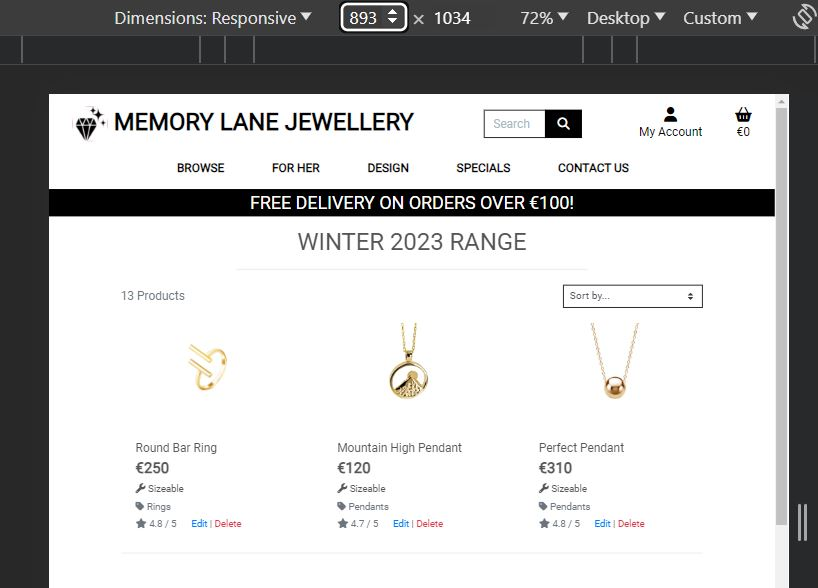
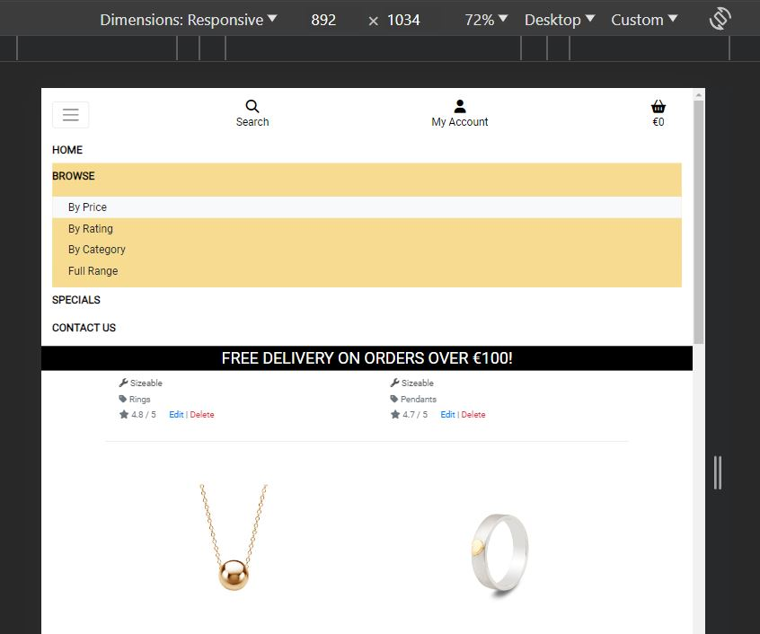
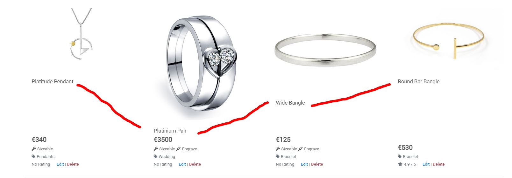
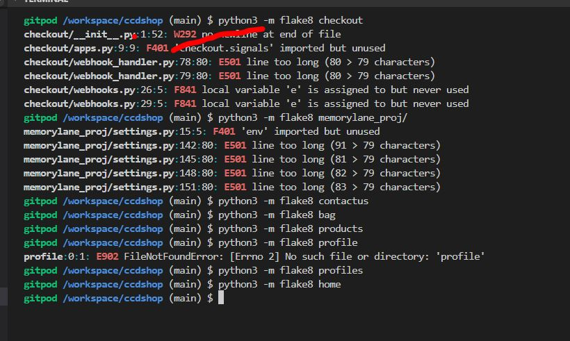

# TESTME

## TABLE OF CONTENTS

* [RESPONSIVENESS TESTING](#responsiveness-testing)
* [BROWSER COMPABILITY TESTING](#browser-compability-testing)
* [BUGS RESOLVED AND UNRESOLVED](#bugs-resolved-and-unresolved)
* [LIGHTHOUSE REPORTS](#lighthouse-reports)
* [CODE VALIDATION](#code-validation)
* [FEATURES TESTING](#features-testing)

Return back to the [README.md](README.md) file.

- - -

## RESPONSIVENESS TESTING

Both development and deployed versions of the project were tested on multiple devices & via chrome dev tools for responsiveness issues.

The navigation items collapse at width of 892 pixels to a bootstrap burger menu, dropping 2 of the menu items namely `FOR HER & DESIGN` & adding a `Home` link since the logo and title are no longer rendered.

---
|At 893 Pixels|Collapse at 892 pixels|
|:---:|:---:|
|||

## BROWSER COMPABILITY TESTING

The deployed project was tested on 3 browsers to check for compatibility issues and works as expected.

|Browser | Screenshot | 
|:---:|:---: |
| Chrome |   |
| FireFox  |   |
| Edge  |   |

 

- - -

## BUGS RESOLVED AND UNRESOLVED 

#### Custom 404 Page does not load
I followed these instructions on LMS  

  

but could not get mycustom 404 page to load. It proved long winded to test as had to be tested after deployment.  I keep getting Server Error 500  

 

Following several attempts and with deadline approaching I changed tack & decided to use W3Schools simple [implementation of custom 404](https://www.w3schools.com/django/django_404.php) but same result. I then removed all custom 404 and deployed to check if django built-in 404 page would display & sure enough it did as per the Not Found rendered :   

 

& confirmed 404 error code was generated by this heroku log snippet  

This I was not expecting as I had double & triple checked both LMS & W3Schools implementations of custom 404 so I suspected it may be generic problem with all 404 pages But when the build in displayed okay this stumped me.  I could not find any similar problems on slack or stackoverflow. I rolled back to deployed version v52 on the heroku build  

  

Then I ran app again to check the heroku logs but still the same Server Error 500 & 500 error on the heroku logs  

  

In order to submit on time I have reverted to my custom handler404 function as per Code Institute LMS and am in contact with tutor support at time of writing (although being xmas week there is TUTORING SERVICE LIMITATION atm) so had to submit with this bug.

Post Submit Update :

I could see on slack that others with similar issues were advised to just drop the custom 404 html into templates & nmot to bother with CI's instructions wrt handler404 function, I contacted tutor support in Jan 2024 who confirmed same. Fortunatley I was able to get the 404 error correctly generated rather than the 500 server error by simplifing my custom 404 html & using Djangos build in handlers (drop 404.html into templates).

#### Shopping Bag Quantity -/+ Disable Bug
This is an intermittent bug that I have come across twice now but cannot reproduce at will so difficult to pin it down to fix it so as of 4 days to submission it still exists afaik. The quantity selectors ie the + & - buttons in the shopping bag freeze as if the js `handleEnableDisable` function in `products/templates/products/includes/quantity_input_script.html` disabled both the `plusDisabled & minusDisabled`.

#### Product name misalignment

Not so much a bug but need to tidy up presentation of product names in say the Full Range Page, On large screens when 4 product cards across the screen the product name is misaligned in some cases with other product in the row.  This needs investigation but my instinct is that since the image dimensions vary it may be throwing the alignment of the product name. See below for example

## LIGHTHOUSE REPORTS

Below are Lighthouse reports for the deployed project - lower scores than I would like on performance & accessibility.  Third party code such as stripe utility , fontawesome CDN, bootstrap CDN, JQuery & google fonts effected performance but as they are necessary I was unable to improve on this. There are duplicate ARIA ID's used by ALLAuth which reduced the accessubility score.  The blue on yellow for the footer does not have a sufficient contrast ratio, this may not be corrected before submitting.

|Page | Screenshot | 
|:---:|:---: |
|Home | |
|Products | |
|SignIn  | |
|Bag  | |

- - -
## CODE VALIDATION

### HTML

[HTML W3C Validator](https://validator.w3.org/) Screenshots

|Page |Screenshot | Notes  | 
|:---:|:----------------------:|---|
| Home  | | Yes <li> is not allowed in nav element but needed in this case, Duplicate ID I think has to do with one block being displayed on large screen and one for small screens, The Aria labelled was pointed out by lighthouse also, The warning can be ignored
| Products | | | Same errors reported as above|
| Bag |   | The id_qty_1 duplicate ID is not actually used, it is inherited from Boutiqu eAdo code & i understand it has to do with a bug on the BAdo quantity & size when using the box, but I vewritten my own js to cater for that before I realised there was bug in BAdo, Unfortunatley I did not have the time to investigate the increment/decrement fully to safely remove the duplicate id
| Checkout |   | I can't see this for/label error I don;t think its hidden |

- - - 

### CSS

[HTML W3C Validator](https://validator.w3.org/) also used to validate the css as shown :

|File |Screenshot | Notes  | 
|:---:|:----------------------:|---|
| Base | | Clear |
| Checkout | | Clear|
| Profiles | | Clear |

- - - 

### JAVASCRIPT

The [JShint Validator](https://jshint.com/) was used to validate the JavaScript snippets.

### PYTHON

The [Code Institute Python Linter](https://pep8ci.herokuapp.com) was used to validate Python files.

As of a week before submitting bag, products, home & profiles apps were cleared of all flake8 errors, The only app with flake8 errors is checkout which has the following

 

 I did not break these 2 E501 lines in webhook handler as = 80 characters and for readibility I left it alone.  WRT the F841 on webhooks - the "e" variable is used as far as I can tell so I do not understand this complaint.  If time allows I hope to check again before submitting.

Update :
The [Code Institute Python Linter](https://pep8ci.herokuapp.com) was used to validate Python files early on but it has been several weeks now & many changes since & unfortunately have not had time to re validate.  I have again cleared Flake8 warnings on all but the checkout application.

Flake8 Results
 

For readability I have left lines 78 & 79 on webhookhandler.py.  Variable e is dealt with in previous section.  

WRT settings.py, I do not understand enough about F401 to take action & all the rest E501's cannot be shortened.

## FEATURES TESTING

### Common header & footer to all pages 

 Navigation Links & Menu Items
TEST            | Clicking EXPECTATION or OUTCOME                          | Result  
--------------- | -------------------------------- | ---------------
Home page | - Click "Memory Lane Jewellery" in the navigation bar redirects to the home page. -  | PASS
All products page | Click "Full Range" in any of `BROWSE` `FOR HER` `DESIGN`dropdown menus renders all porducts, 2) category shows a dropdown list so I have access to more sort/filter options. The page title indicates the users location on the site. | PASS
Register page | Click "register" link in the navigation bar redirects to the register page. The page heading indicates the users location on the site. | PASS
Login / Logout page | Clicking the "login" or "logout links in the navigation bar redirects to the login or logout page. | PASS
Bag page | Click the "basket" icon in the navigation bar, pulls up the bag page | PASS
My Profile page | When clicking the "My profile" link in the navigation bar, the browser redirects to the profile page. The page heading is "MLJ AUTH" indicates the users location on the site. | PASS
Product management page | When clicking the "Add New Product" menu item as an admin user, the browser redirects to the product management page. The page heading is "MLJ ADD. | PASS
Search bar | When searching for a keyword, the results will show products that contain the keyword in the product name or description.  | PASS

### Footer

TEST            | DETAILS                          | Result  
--------------- | -------------------------------- | ---------------
Facebook | Clicking the Facebook icon opens a new tab which displays Mockup of MLJ's facebook page. | PASS
Privacy Policy | Loads privacy policy page | PASS

### Home page
TEST            | Details                          | Result  
--------------- | -------------------------------- | ---------------
shop now | loads all products for user to browse | pass

### Products page 

This page is reached from `Shop now` or `Continue Shopping` or `Keep Shopping` buttons.  Also some or all products in the database are displayed on screen when any of the options in nav menus BROWSE, FOR HER, DESIGN, SPECIALS are clicked. 

TEST            | DETAILS                          | Result  
--------------- | -------------------------------- | ---------------
Product images | All images displaying correctly  | PASS
Responsiveness | Check every element on the page for consistent scalability in mobile, tablet and desktop view.| 90% ok- some misalignment in product name as outline in bug section 
Sort | Check sort in both directions by **Price, Rating, Name & Category** to ensure each option reloads the page and sorts the products in the corresponding order sleected. | PASS
Edit Button (Admin only) | Check the edit button is only displayed when admin user is logged in, Check that when clicked it loads the product management page in order to edit the corresponding product | PASS
Delete Button (Admin only) | Check the delete button is only displayed when admin user is logged in, Check that when clicked the corresponding product is deleted from the db & a success message that the product has been deleted is displayed | PASS

### Product details page
TEST            | DETAILS                          | Result  
--------------- | -------------------------------- | ---------------
Image | There is one image per product, Ensure the image is displayed correctly on all screen sizes, on clicking the image a larger version is displayed on another tab | Pass 
Details | Confirm correct Name, Price, Category, Rating & Quantity (default 1), & if relevant Size dropdown (default M) & Add Engrave checkbox, Confirm button hover : Continue Shopping  & Add to bag  work as expected | PASS 
Quantity Selector | Check the quantity selector functionality by selecting minus and plus buttons & Ensure can only use 1 to 5 | PASS
Add to Bag | Confirm Product, Size, Quantity & Engraving details are added correctly to bag | PASS
Edit Button (admin only) | Check the edit button is only displayed when admin user is logged in, Check that when clicked it loads the product management page in order to edit the corresponding product | PASS
Delete Button (admin only) | Check the delete button is only displayed when admin user is logged in, Check that when clicked the corresponding product is deleted from the db & a success message that the product has been deleted is displayed | PASS

### Shopping Bag page
TEST            | DETAILS                          | Result  
--------------- | -------------------------------- | ---------------
Items in bag | CONFIRM  - the correct number of items in the bag & that the details (Quantity, Size, Engrave Text, Subtotal) of each line is correct| PASS
Remove item from cart | Clicking the remove link on an item removes the item from the cart. | PASS
Quantity Selector | Check the quantity selector functionality by selecting min and plus buttons where applicable. Adding a product to the cart to confirm the correct quantity selected is correct. Try with many different combinations of product sizes quantities & engrave text | Although there is a DOCUMENTED BUG (intermittent and not reproducable) in this area I have not come across it during vigorous testing so I am inclined to set this to PASS
Free delivery threshold | Adding products to the cart where the grand total value is under €100, the cart shows the free delivery warning message. The message disappears when the grand total is over €100. | PASS

### Checkout page
TEST            | EXPECTATION or OUTCOME                          | RESULT
--------------- | -------------------------------- | ---------------
Order details | verify correct items & values in order | Pass
Save delivery info| Verify delivery details updated | Pass
Do not save delivery Info | Verify delivery not updated | pass
Subscribe to newsletter | Verify UserProfile updated correctly | Pass
Do not subscribe to newsletter |Verify UserProfile updated correctly | Pass
Invalid address/ zip code details  | Filling in the form with the incorrect details gives errors messages. | PASS
Card stolen/ Insufficient Funds | Used various stripe test card to check for particular messages. | PASS

### Checkout success page
TEST            | EXPECTATION or OUTCOME                          | Result  
--------------- | -------------------------------- | ---------------
Order on page | Verify correct details on page, Verify correct, Verify if delivery was saved or not ans same with newsletter subscription | PASS
Order on DB | Verify correct details on DB | PASS

### Contact us page
TEST            | EXPECTATION or OUTCOME       | Result
--------------- | -------------------------------- | ---------------
Submit wedding request| User received confirmation of receipt, admin confirms request in DB with correct details & wedding box clicked | Pass
Submit non wedding request| User received confirmation of receipt, admin confirms request in DB with wedding = false | Pass
Invalid email | user notified | Pass

### Product management / superuser tasks
TEST            | EXPECTATION or OUTCOME                          | Result  
--------------- | -------------------------------- | ---------------
Add new product | Expect toast message, verify Product added to database, ensure Product searchable, Product Details page with correct details as in image, name, category, price, sizeable, engrave etc | PASS
Edit Product | Expect toast message that Product added to database, ensure Product searchable, Product Details page with correct details as in image, name, category, price, sizeable, engrave etc | pass
Delete Product | confirm product no longer searchable | Pass for Development DB but Not yet tested on production DB
View Subscribe List | Verify emails on list are all users with subscribe_newsletter=True on DB | Pass

Return back to the [README.md](README.md) file.