# TESTING

## TABLE OF CONTENTS

* [RESPONSIVENESS TESTING](#responsiveness-testing)
* [BROWSER COMPABILITY TESTING](#browser-compability-testing)
* [BUGS RESOLVED AND UNRESOLVED](#bugs-resolved-and-unresolved)
* [LIGHTHOUSE REPORTS](#lighthouse-reports)
* [CODE VALIDATION](#code-validation)
* [FEATURES TESTING](#features-testing)

Return back to the [README.md](README.md) file.

- - -

## RESPONSIVENESS TESTING

Both development and deployed versions of the project were tested on multiple devices & via chrome dev tools for responsiveness issues.

## BROWSER COMPABILITY TESTING

 
 

The deployed project was tested on 3 browsers to check for compatibility issues and works as expected.

|Browser | Screenshot | 
|:---:|:---: |
| Chrome | 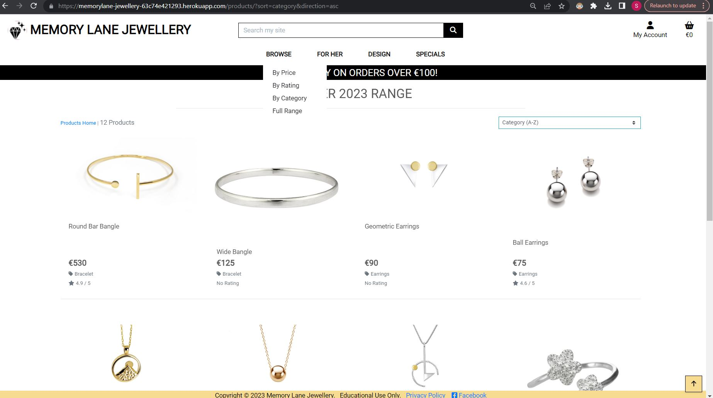  |
| FireFox  | 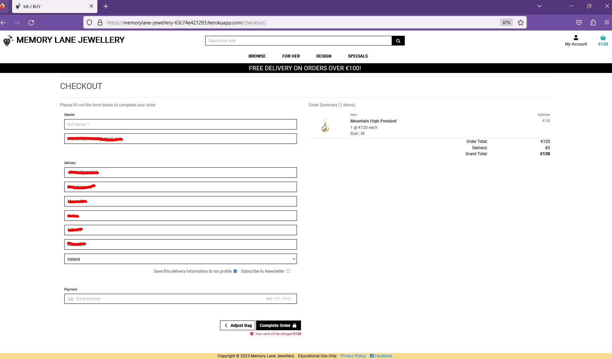  |
| Edge  | 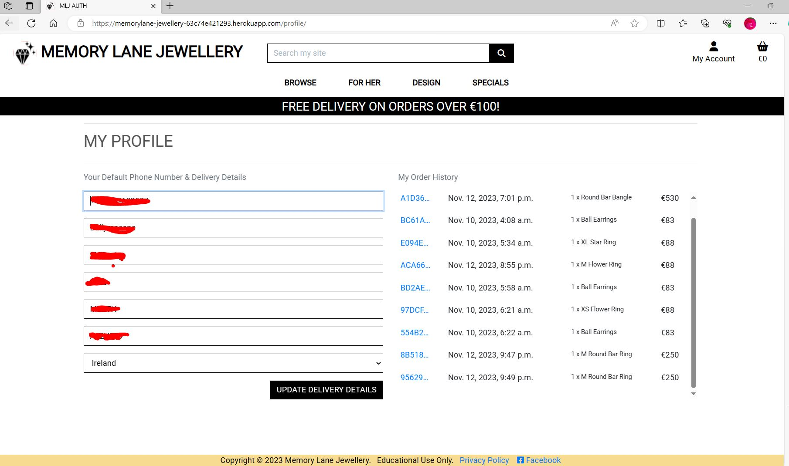  |

 

- - -

## BUGS RESOLVED AND UNRESOLVED 

#### Custom 404 Page does not load
I followed these instructions on LMS 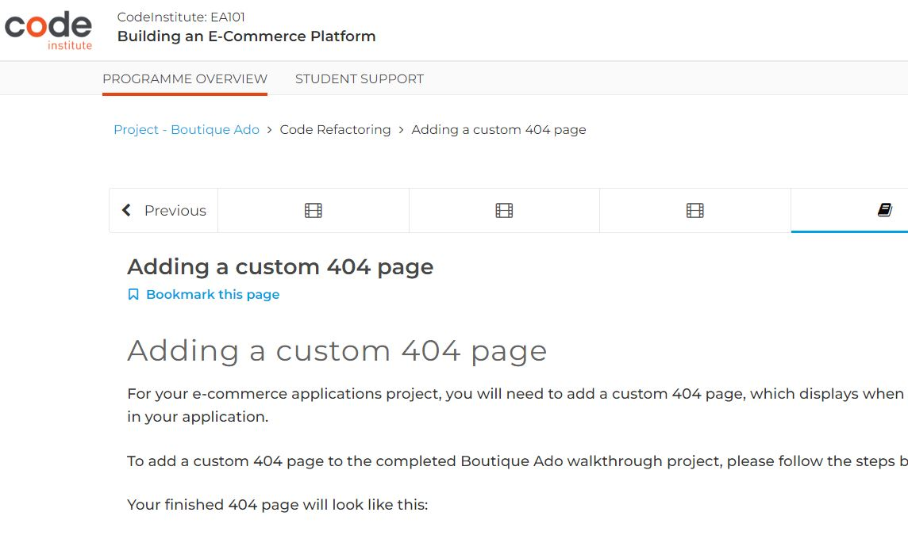 but could not get mycustom 404 page to load. It proved long winded to test as had to be tested after deployment.  I keep getting Server Error 500 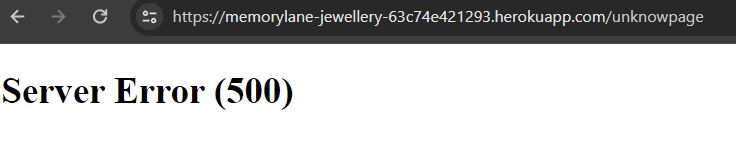.  Following several attempts and with deadline approaching I changed tack & decided to use W3Schools simple [implementation of custom 404](https://www.w3schools.com/django/django_404.php) but same result. I then removed all custom 404 and deployed to check if django built-in 404 page would display & sure enough it did as per Not Found 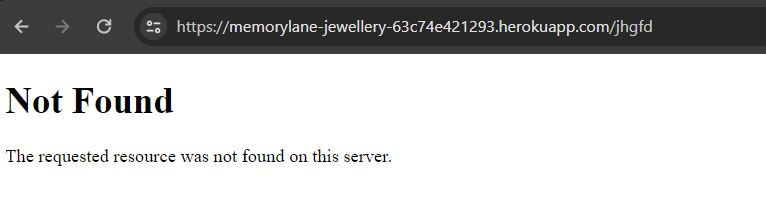 & confirmed 404 error code by this heroku log snippet 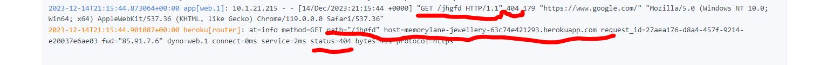.  This I was not expecting as I had double & triple checked both LMS & W3Schools implementations of custom 404 so I suspected it may be generic problem with all 404 pages But when the build in diusplayed okay this stumped me.  I could not find any similar problems on slack or stackoverflow. I rolled back 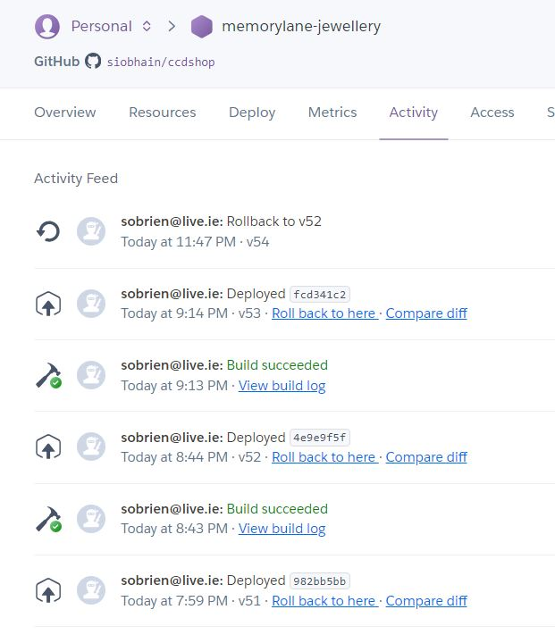 on the heroku build version & ran app again to check the heroku logs but still the same Server Error 500 & 500 error on the heroku logs 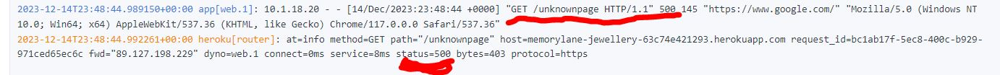
I have reverted to my custom 404 as per the LMS and am in contact with tutor support (although TUTORING SERVICE LIMITATION atm) at time of writing.

## LIGHTHOUSE REPORTS

Below are Lighthouse reports for the deployed project - lower scores than I would like on performance & accessibility.  Third party code such as stripe utility , fontawesome CDN, bootstrap CDN, JQuery & google fonts effected performance but as they are necessary I was unable to improve on this. There are duplicate ARIA ID's used by ALLAuth which reduced the accessubility score.  The blue on yellow for the footer does not have a sufficient contrast ratio, this may not be corrected before submitting.

|Page | Screenshot | 
|:---:|:---: |
|Home |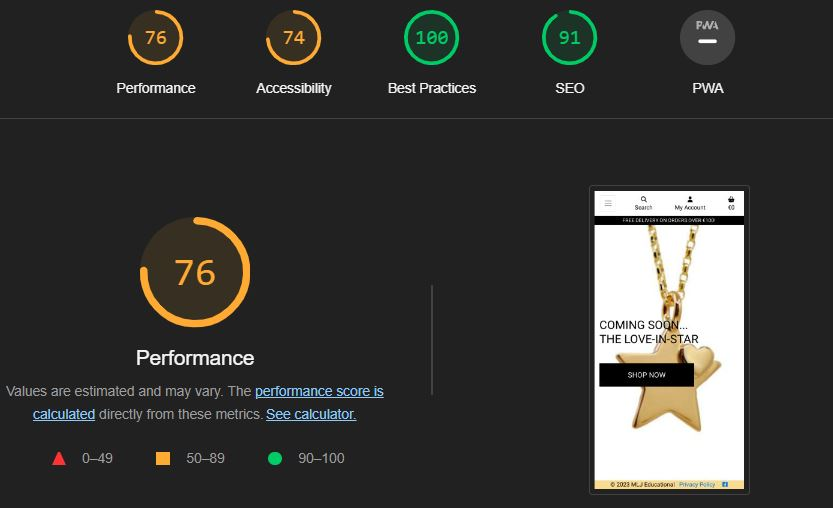 |
|Products |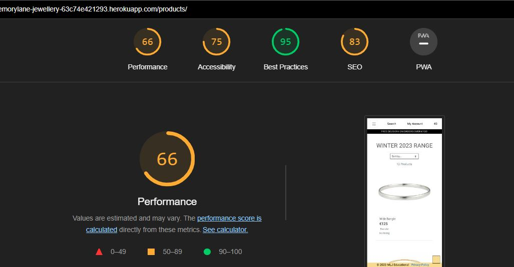 |
|SignIn  |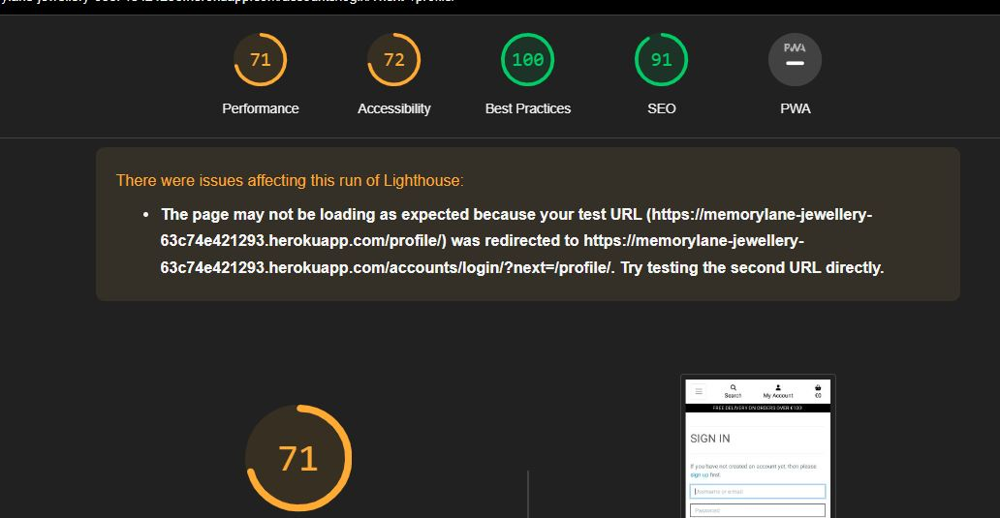 |
|Bag  |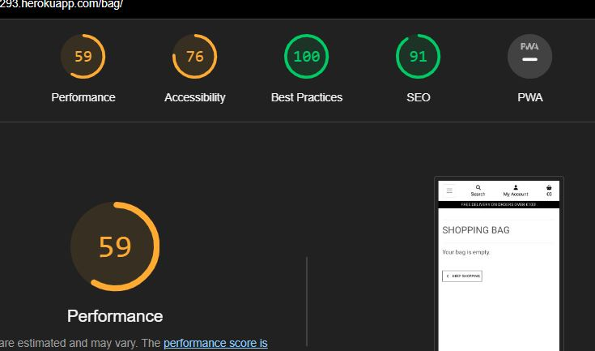 |

- - -
## CODE VALIDATION

### HTML

[HTML W3C Validator](https://validator.w3.org/) Screenshots

|Page |Screenshot | Notes  | 
|:---:|:----------------------:|---|
| Home  |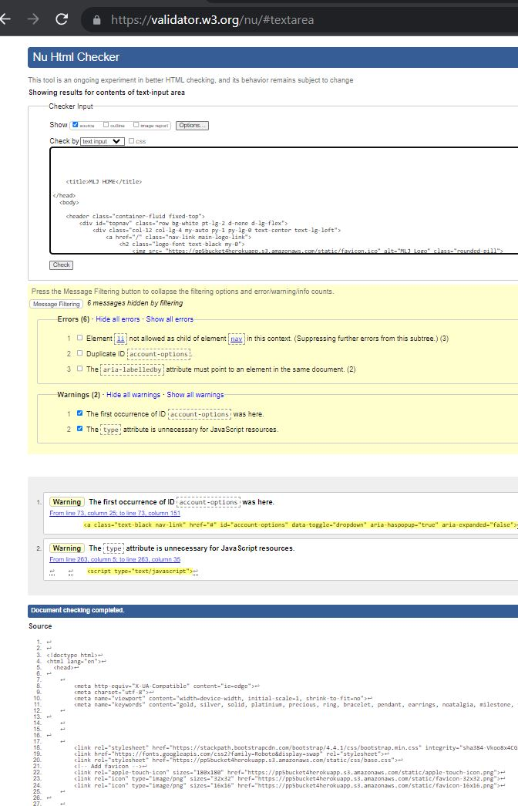 | Yes <li> is not allowed in nav element but needed in this case, Duplicate ID I think has to do with one block being displayed on large screen and one for small screens, The Aria labelled was pointed out by lighthouse also, The warning can be ignored
| Products |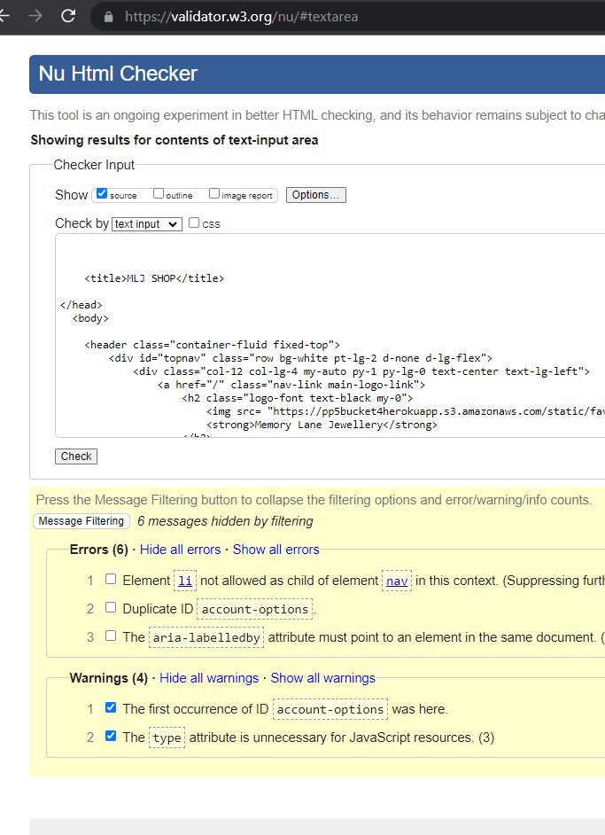 | | Same errors reported as above|
| Bag | 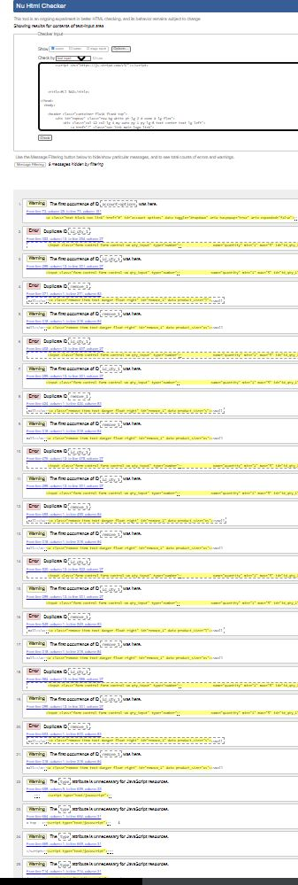  | The id_qty_1 duplicate ID is not actually used, it is inherited from Boutiqu eAdo code & i understand it has to do with a bug on the BAdo quantity & size when using the box, but I vewritten my own js to cater for that before I realised there was bug in BAdo, Unfortunatley I did not have the time to investigate the increment/decrement fully to safely remove the duplicate id
| Checkout | 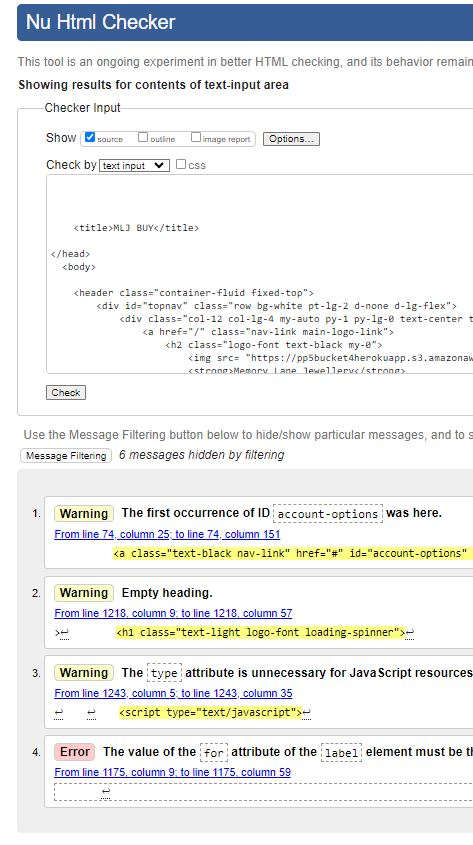  | I can't see this for/label error I don;t think its hidden |

- - - 

### CSS

[HTML W3C Validator](https://validator.w3.org/) also used to validate the css as shown :

|File |Screenshot | Notes  | 
|:---:|:----------------------:|---|
| Base |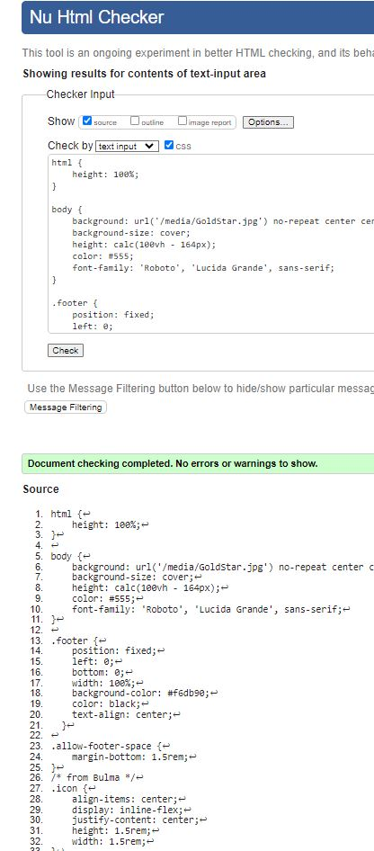 | Clear |
| Checkout |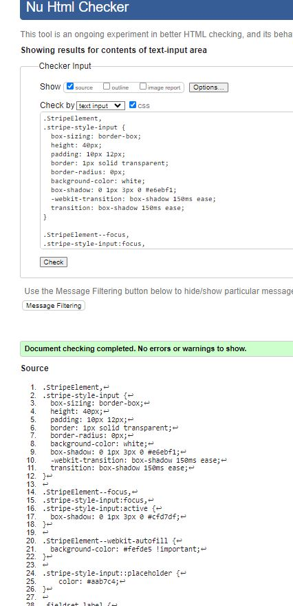 | Clear|
| Profiles |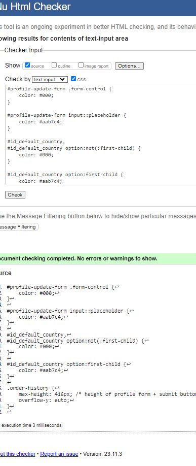 | Clear |

- - - 

### JAVASCRIPT

The [JShint Validator](https://jshint.com/) was used to validate the JavaScript snippets.

- - - 

### PYTHON

The [Code Institute Python Linter](https://pep8ci.herokuapp.com) was used to validate Python files.

As of a week before submitting bag, products, home & profiles apps were cleared of all flake8 errors, The only app with flake8 errors is checkout which has the following

 

 I did not break these 2 E501 lines in webhook handler as = 80 characters and for readibility I left it alone.  WRT the F841 on webhooks - the "e" variable is used as far as I can tell so I do not understand this complaint.  If time allows I hope to check again before submitting.

The [Code Institute Python Linter](https://pep8ci.herokuapp.com) was used to validate Python files.

| File | Screenshot  | Notes|
| --- | ------ |:---:|
| settings.py |   | Pass |
| urls.py (main) |   | Pass |

## FEATURES TESTING

Navigation Links & Menu Items
TEST            | OUTCOME                          | PASS / FAIL  
--------------- | -------------------------------- | ---------------
Home page | Clicking " Memory Lane Jewellery" in the navigation bar redirects to the home page. | PASS
All products page | When clicking the "Full Range" in the dropdown menus, the category shows a dropdown list so I have access to more sort/filter options. The page heading indicates the users location on the site. | PASS
Register page | Clicking the "register" link in the navigation bar redirects to the register page. The page heading indicates the users location on the site. | PASS
Login / Logout page | Clicking the "login" or "logout links in the navigation bar redirects to the login or logout page. | PASS
Bag page | When clicking the "basket" icon in the navigation bar, the browser redirects me to the bag page. The page heading indicates the users location on the site. | PASS
My Profile page | When clicking the "My profile" link in the navigation bar, the browser redirects to the profile page. The page heading is "MLJ AUTH" indicates the users location on the site. | PASS
Product management page | When clicking the "Add New Product" menu item as an admin user, the browser redirects to the product management page. The page heading is "MLJ ADD. | PASS
Search bar | When searching for a keyword, the results will show products that contain the keyword in the product name or description. The page HEader is "MLJ SHOP" | PASS

### Footer

TEST            | DETAILS                          | PASS / FAIL  
--------------- | -------------------------------- | ---------------
Facebook | Clicking the Facebook icon opens a new tab which displays Mockup of MLJ's facebook page. | PASS

### Home page
TEST            | Details                          | PASS / FAIL  
--------------- | -------------------------------- | ---------------

### Products page (from `Shop now` or `Continue Shopping` or `Keep Shopping` buttons)
TEST            | DETAILS                          | PASS / FAIL  
--------------- | -------------------------------- | ---------------
Product images | All images displaying correctly  | PASS
Responsiveness | Check every element on the page for consistent scalability in mobile, tablet and desktop view.| PASS
Sort | Check sort in both directions by **Price, Rating, Name & Category** to ensure each option reloads the page and sorts the products in the corresponding order sleected. | PASS
Edit Button (Admin only) | Check the edit button is only displayed when admin user is logged in, Check that when clicked it loads the product management page in order to edit the corresponding product | PASS
Delete Button (Admin only) | Check the delete button is only displayed when admin user is logged in, Check that when clicked the corresponding product is deleted from the db & a success message that the product has been deleted is displayed | PASS

### Product details page
TEST            | DETAILS                          | PASS / FAIL  
--------------- | -------------------------------- | ---------------
Image | There is one image per product, Ensure the image is displayed correctly on all screen sizes, on clicking the image a larger version is displayed on another tab | PASS
Details | Confirm correct Name, Price, Category, Rating & Quantity (default 1), & if relevant Size dropdown (default M) & Add Engrave checkbox, Confirm button hover : Continue Shopping  & Add to bag  work as expected | PASS
Quantity Selector | Check the quantity selector functionality by selecting minus and plus buttons  | PASS
Add to Bag | Confirm Product, Size, Quantity & Engraving details are added correctly to bag | PASS
Edit Button (Admin only) | Check the edit button is only displayed when admin user is logged in, Check that when clicked it loads the product management page in order to edit the corresponding product | PASS
Delete Button (Admin only) | Check the delete button is only displayed when admin user is logged in, Check that when clicked the corresponding product is deleted from the db & a success message that the product has been deleted is displayed | PASS

### Shopping Bag page
TEST            | DETAILS                          | PASS / FAIL  
--------------- | -------------------------------- | ---------------
Items in bag | CONFIRM  - the correct number of items in the bag, 
- the correct products in the bag, - by quantity, size & engrave option are listed on the page| PASS
Remove item from cart | Clicking the remove link on an item removes the item from the cart. | PASS
Quantity Selector | Check the quantity selector functionality by selecting min and plus buttons where applicable. Adding a product to the cart to confirm the correct quantity selected is correct. | PASS
Free delivery threshold | Adding products to the cart where the grand total value is under £50, the cart shows the free delivery warning message. The message disappears when the grand total is over £50. | PASS

### Checkout page
TEST            | OUTCOME                          | PASS / FAIL  
--------------- | -------------------------------- | ---------------
Media | All media assets are displayed properly, have no pixelation or stretched images and are responsive on all devices. | PASS
Responsiveness | Check every element on the page for consistent scalability in mobile, tablet and desktop view.| PASS
Checkout form | Filling in the form with the correct validation processes the order. | PASS
Checkout form | Filling in the form with the incorrect validation shows errors messages. | PASS
Save details checkout | Selecting the "Save this delivery information to my profile" checkbox, this saves/updates my profile details. | PASS
Card authentication | Used the Stripe test card details and purposely failed authenticated to check for error messages. | PASS

### Checkout success page
TEST            | OUTCOME                          | PASS / FAIL  
--------------- | -------------------------------- | ---------------
Responsiveness | Check every element on the page for consistent scalability in mobile, tablet and desktop view.| PASS
Order history | When clicking on an order number in the order history section, this takes me to a past order confirmation summary page. | PASS
Updating my profile | When updating the default delivery information, this reflects on the checkout page. | PASS

### Product management page
TEST            | OUTCOME                          | PASS / FAIL  
--------------- | -------------------------------- | ---------------
Responsiveness | Check every element on the page for consistent scalability in mobile, tablet and desktop view.| PASS
Adding a product | When filling out the form to add a new product, the product is added to the relevant category and is searchable via the search bar. | PASS
Uploading an image | When uploading an image to a new product, the site shows the name of the file that will be uploaded. When checking the product details page, the image also shows. | PASS
 

Return back to the [README.md](README.md) file.