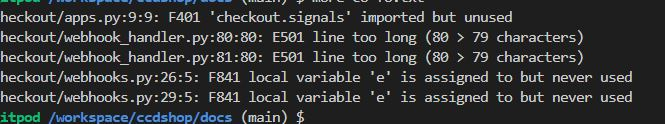

# TESTING

## 🚀 TABLE OF CONTENTS

* [RESPONSIVENESS TESTING](#responsiveness-testing)
* [BROWSER COMPABILITY TESTING](#browser-compability-testing)
* [BUGS RESOLVED AND UNRESOLVED](#bugs-resolved-and-unresolved)
* [LIGHTHOUSE REPORTS](#lighthouse-reports)
* [CODE VALIDATION](#code-validation)
* [USER STORIES TESTING](#user-story-testing)
* [FEATURES TESTING](#features-testing)

Return back to the [README.md](README.md) file.

- - -

## RESPONSIVENESS TESTING

👇

Both development and deployed versions of the project were tested on multiple devices & via chrome dev tools for responsiveness issues.

## BROWSER COMPABILITY TESTING

👇

The deployed project was tested on 3 browsers to check for compatibility issues and works as expected. 

|Browser | Screenshot | 
|:---:|:---: |
| Chrome |   |
| FireFox  |   |
| Edge  |   |

- - -

## BUGS RESOLVED AND UNRESOLVED 

☠️ The issues listed  below were indentified during the development of the project.

👇

- - -

## LIGHTHOUSE REPORTS

👇

Below are Lighthouse reports for the deployed project, lower than I want on performance & accessibility.  Third party code such as stripe utility , fontawesome CDN, bootstrap CDN, JQuery & google fonts effected performance but as they are necessary I was unable to improve on this. There are duplicate ARIA ID's used by ALLAuth which reduced the accessubility score.  The blue on yellow for the footer does not ahve a sufficient contrast ratio, this may not be corrected before submitting.

|Page | Screenshot | 
|:---:|:---: |
|Home | |
|Products | |
|SignIn  | |
|Bag  | |

- - -

## CODE VALIDATION

👇

### HTML

[HTML W3C Validator](https://validator.w3.org/) Screenshots

|Page |Screenshot | Notes  | 
|:---:|:----------------------:|---|
| Home  | | Yes <li> is not allowed in nav element but needed in this case, Duplicate ID I think has to do with one block being displayed on large screen and one for small screens, The Aria labelled was pointed out by lighthouse also, The warning can be ignored
| Products | | | Same errors reported as above|
| Bag |   | The id_qty_1 duplicate ID is not actually used, it is inherited from Boutiqu eAdo code & i understand it has to do with a bug on the BAdo quantity & size when using the box, but I vewritten my own js to cater for that before I realised there was bug in BAdo, Unfortunatley I did not have the time to investigate the increment/decrement fully to safely remove the duplicate id
| Checkout |   | I can't see this for/label error I don;t think its hidden |

- - - 

### CSS

[HTML W3C Validator](https://validator.w3.org/) also used to validate the css as shown :

|File |Screenshot | Notes  | 
|:---:|:----------------------:|---|
| Base | | Clear |
| Checkout | | Clear|
| Profiles | | Clear |

- - - 

### JAVASCRIPT

The [JShint Validator](https://jshint.com/) was used to validate the JavaScript snippets.

- - - 

### PYTHON

The [Code Institute Python Linter](https://pep8ci.herokuapp.com) was used to validate Python files.

As of a week before submitting bag, products, home & profiles apps were cleared of all flake8 errors, checkout had the following

 

 I did not break these 2 E501 lines in webhook handler as = 80 characters and for left alone for readibility.  WRT the F841 on webhooks - the variable e is used as far as I can tell do did not understand this complaint.|

If time allows I hope to check again before submitting.

The [Code Institute Python Linter](https://pep8ci.herokuapp.com) was used to validate Python files.

| File | Screenshot  | Notes|
| --- | ------ |:---:|
| settings.py |   | Pass |
| urls.py (main) |   | Pass |

## USER STORY TESTING

👇

### New Site Users

### **Registered Users**

- - -

As a registered user of the site, I want to be able to:
## FEATURES TESTING

👇

- - -

## AUTOMATED TESTING

👇

There was not automated testing implemented with this project.

- - -

Return back to the [README.md](README.md) file.